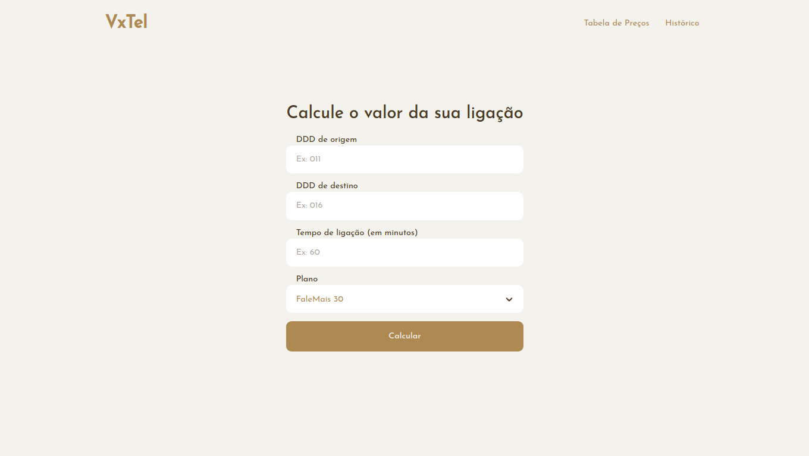

# VxTel :telephone_receiver:
 > Projeto web desenvolvido para o challenge da Vortx

<div align="center">
  <a href="https://github.com/GeovaniJose/vortx-falemais">
    
  </a>
</div>

## Instalação :sparkles:
> Você precisa ter instalado em sua máquina o [Git](https://git-scm.com) e o [Yarn](https://yarnpkg.com/)
1. Clone este repositório
```bash
$ git clone https://github.com/GeovaniJose/vortx-falemais
```

2. Entre na pasta do repositório
```bash
$ cd vortx-falemais
```

3. Rode o comando para instalar as dependências
```bash
$ yarn
```

## Como rodar :heavy_check_mark:
> Passo a passo para rodar a aplicação
1. Rode o comando para iniciar a aplicação
```bash
$ yarn start
```

## Tecnologias :wrench:
> Tecnologias usadas no desenvolvimento do projeto:
- ReactJS
- TypeScript
- Yarn
- Styled-components
- LocalStorage
- react-router-dom
- ContextAPI
- React Select
- Unform
- Intl

## License :page_facing_up:
[MIT License](LICENSE)
